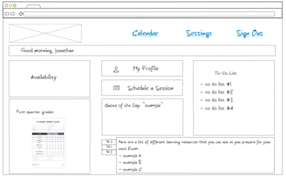

# SpencerTutors
## Description Deliverable
### Elevator Pitch
Looking for personalized academic support from the comfort of your own home? I offer one-on-one sessions to help you achieve your academic goals. Whether you're struggling with a particular subject or just want to improve your grades, I can provide the individual attention and guidance you need to succeed. With flexible scheduling and affordable pricing, I make it easy to get the help you need, when you need it. Contact me today to schedule your first session!
### Design
<picture>
  <source media="(prefers-color-scheme: dark)" srcset="Picture1.png">
  
</picture>

### Key Features
- Secure login over HTTPS
- Ability to set tutoring appointments
- Able to view a calendar
- Able to set tasks with due dates
- Leave ratings from sessions
- Able to view notes from previous sessions
### Technologies
- **HTML** - Uses HTML structure. I'll need 3 pages. A Home screen, a place to leave a review, and a place to view session history per user
- **CSS** - Application styling, spacing, and use of contrasting colors
- **JavaScript** - Provides login, ability to leave ratings, and updating of session history
- **Service** - Backend service with endpoints for:
    - login
    - submitting reviews
    - retrieving reviews
- **DB** - Store users, reviews, and previoius session information in database
- **Login** - Register and login users. Credentials securely stored in database. Can't meet with me without one.
- **WebSocket** - All website visitors will be able to see the reviews that students leave
- **React** - Application ported to use the React web framework.

## HTML Deliverable
For this deliverable I added the application structure.
- **HTML pages** - Five HTML pages that represent the ability to login, leave reviews, keep track of assignments, view session history, and send messages to me.
- **Links** - The login page automatically links to the home page. After logging in, you are able to link any of the other HTML pages, including the login page (sign out)
- **Text** - Each review leaves a 0-5 star rating, as well as text.
- **Images** - I added an image in the header so that students can recognize me! This can be viewed from every HTML page
- **Login** - Input box and submit button for login.
- **Database** - The voting choices represent data pulled from the database. Previous sessions are also stored in a database, and are viewable from the History section
- **WebSocket** - Displays all reviews from to the Homepage. Also a chat feature in the messages section. Finally, able to add assignments/tasks to take care of in the assignments section

## CSS Deliverable
For this deliverable I properly styled the application into its final appearance.

- **Header, footer, and main content body** - I added some images to the home page, and also made a logo for my website. The logo also function as an icon on the website tab. All code is separated by header, footer, and main body
- **Navigation elements** - I dropped the underlines, added color, and I also added some hovering feautures for the navigation bar and GitHub footer
- **Responsive to window resizing** - My app looks great on all window sizes and devices!
- **Application elements** - Used good contrast of color and whitespace. All pages are consistent in design
- **Application text content** - All fonts are consistent in size and font
- **Application images** - added images and also a logo

## JavaScript Deliverable
For this deliverable I made my application functional to track and display session history, as well as assignments.

- **Login** - When you press the login button it takes you to the home page, and displays the entered email with whatever email you used to login. You aren't able to continue if you leave the boxes blank and click login
- **Database** - Displays all session history on the "History". Currently this is stored and retrieved from local storage, but it will be replaced with the database data later.
- **WebSocket** - I used the setInterval function to display ratings that have been left for me every 2 seconds. This will be replaced with WebSocket messages later.
- **Application Logic** - In the assignments tab, the user is able to remove completed assignments by clicking on the checkbox. This will remove that item completely

## Service Deliverable
For this deliverable, I created an HTTP service to host my frontend and provide backend endpoints.

- **Node.js/Express HTTP service** - done! (index.js, first couple of lines)
- **Static middleware for frontend** - done! (index.js)
- **Calls to third party endpoints** - about.js
- **Backend service endpoints** - Placeholders for login that stores the current user and password on the server. Endpoints for storing session information as well.
- **Frontend calls service endpoints** - I did this use the fetch function.

## DB Deliverable
For this deliverable I stored and retrieved data from MongoDB.

- **MongoDB Atlas database created** - check!
- **Endpoints for data** - My stubbed out endpoints now process the data and send it to Mongo.
- **Stores data in MongoDB** - check!

## Login Deliverable
For this deliverable I associate the votes with the logged in user.

- **User registration** - Creates a new account in the database.
- **Existing user** - Stores the all session history for that specific user when logged in.
- **Use MongoDB to store credentials** - Stores both user and their session history.
- **Restricts functionality** - You cannot view session history, leave a review, or join the session until you have logged in.

## WebSocket Deliverable
For this deliverable I used webSocket to update the votes on the frontend in realtime.

- **Backend listens for WebSocket connection** - working!
- **Frontend makes WebSocket connection** - working!
- **Data sent over WebSocket connection** - working!
- **WebSocket data displayed** - all users on the server can view chat sent between each other in real time

